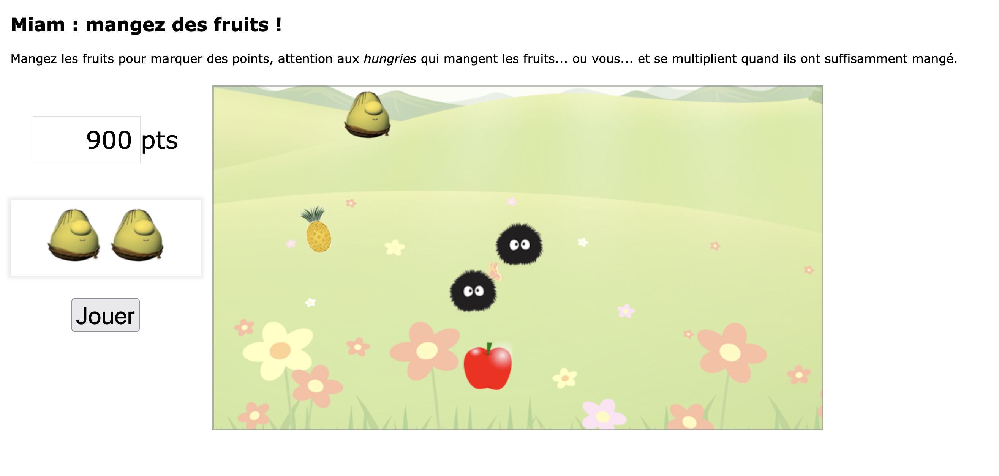

# Mangez des fruits

### Comment installer les fichiers, produire le bundle et exécuter le projet 

Exécuter les commandes suivantes :

```
git clone git@github.com:dragonfish26/hungry.git
npm install
npm run build
```

Vous pouvez ouvrir le fichier `dist/index.html`, pour vérifier que tout s'est bien déroulé en consultant la console (<kbd>Ctrl Shift K</kbd>) dans laquelle vous devez lire le message `le bundle a été généré`.  

  >  Attention, ne confondez pas le fichier `src/index.html` avec le fichier `dist/index.html`.

Une fois que vous avez vu le message et que le bundle est généré, vous pouvez alors jouer au jeu.

### Règles du jeu :

Greedy (la chose verte ressemblant à Shrek) a 3 vies. A chaque fois que Greedy touche un Hungry (la chose noire avec des pics), il meurt. Vous pouvez déplacer le Greedy avec les touches gauche, droite, haut et bas. Si vous mangez un fruit, votre score est augmenté de 100. Attention les fruits apparaissent aléatoirement et disparaissent en quelques secondes.

Démarrez le jeu avec le bouton "jouer" et jouez pour gagner le plus de points !

